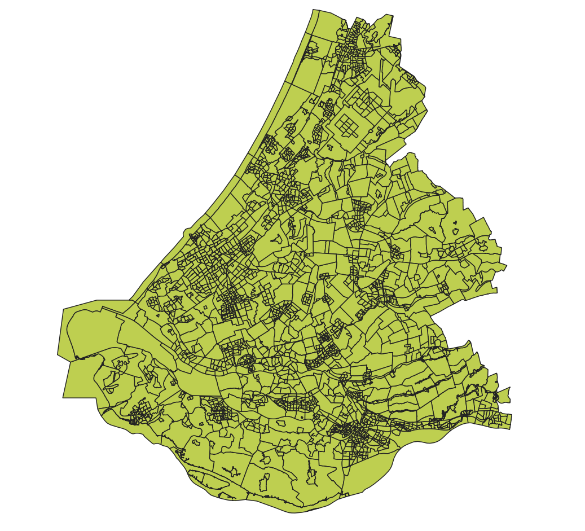
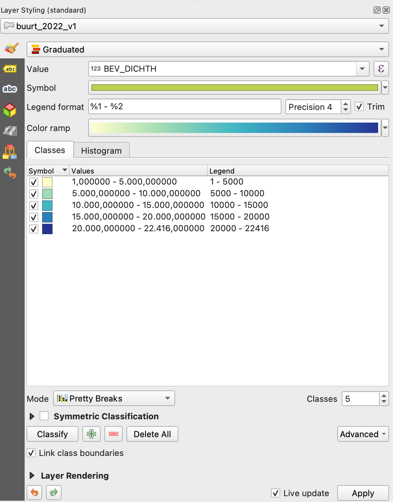
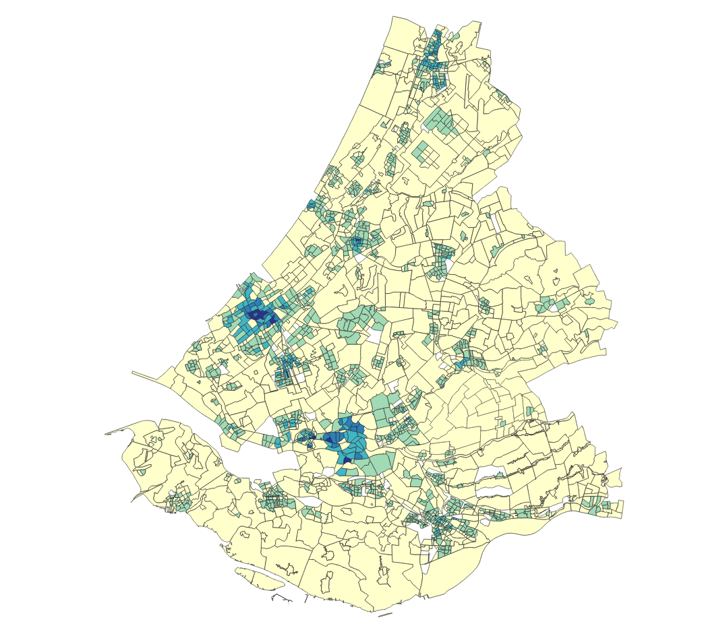
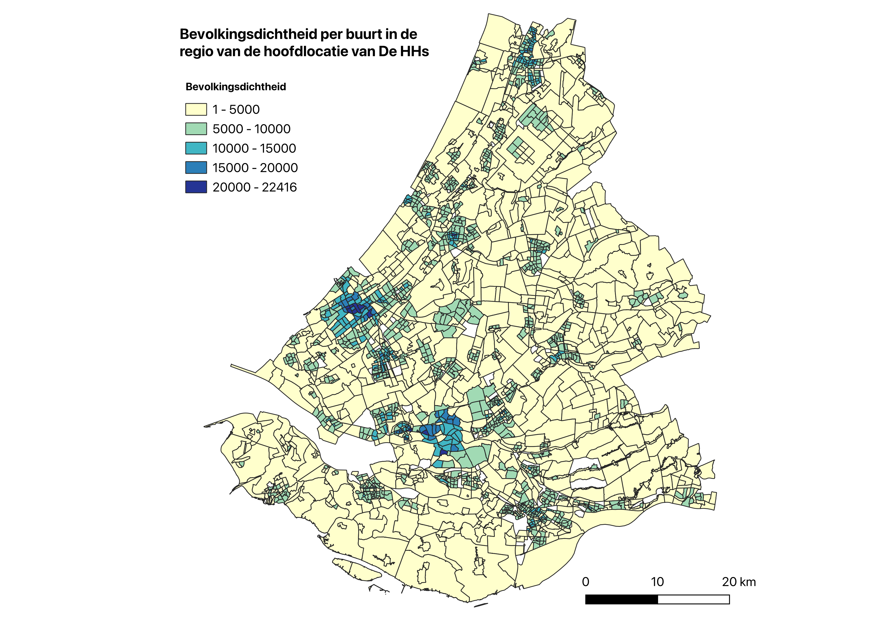
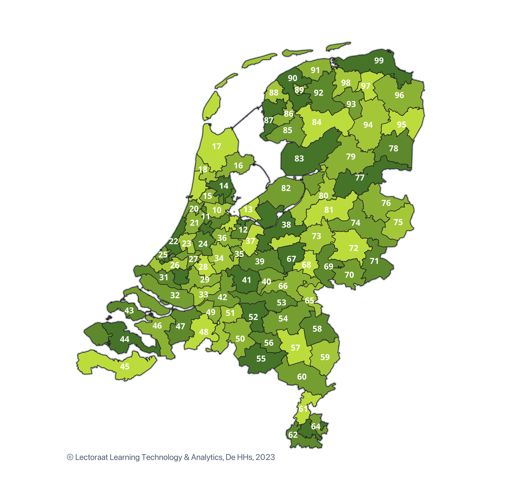
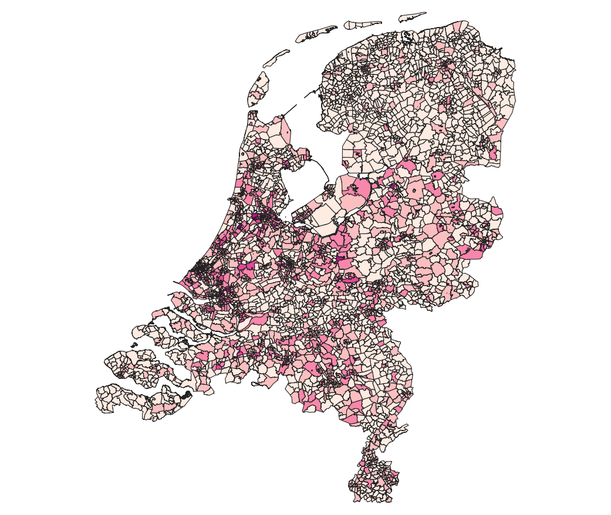
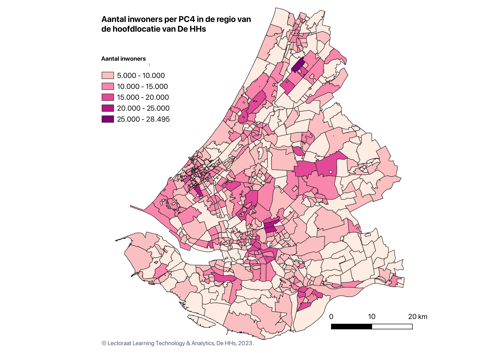
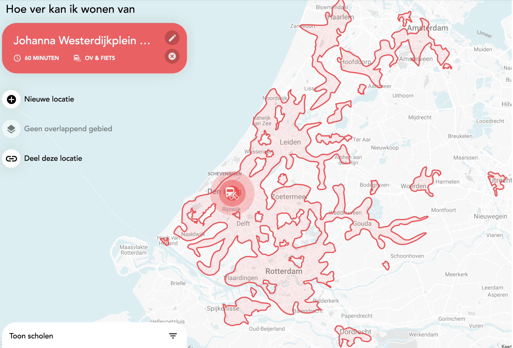

```{=html}
<!--- referenties voor pandoc-crossref 
https://stackoverflow.com/questions/9434536/how-do-i-make-a-reference-to-a-figure-in-markdown-using-pandoc
--> 
```
# Inleiding

## Geografische analyses

Onderdeel van het project [De Staat van De Haagse](https://www.dehaagsehogeschool.nl/onderzoek/kenniscentra/de-staat-van-de-haagse) van het lectoraat Learning Technology & Analytics (LTA) is een geografische analyse van het toeleveringsgebied van De Haagse Hogeschool (De HHs). Hiermee bedoelen we de regio binnen Nederland waar onze studenten vandaan komen.

## Doel van deze handleiding

Deze handleiding van het lectoraat Learning Technology & Analytics beschrijft en verantwoordt de methode om deze gegevens aan elkaar te koppelen en daaruit verbanden op te maken. Heb je suggesties voor verbeteringen? Mail die dan naar Theo Bakker, [t.c.bakker\@hhs.nl](mailto:t.c.bakker@hhs.nl).

## Bronnen: CBS

We maken gebruik van publieke data over gemeenten, wijken en buurten van het [Centraal Bureau voor de Statistiek (CBS)](https://www.cbs.nl/nl-nl). Het CBS biedt data aan per gemeente, wijk en buurt, maar ook per postcode. In de StatLinepublicaties Kerncijfers wijken en buurten (KWB) zijn kerncijfers opgenomen over alle wijken en buurten in Nederland. Deze data bevat statistische kenmerken, zoals geboorte- en sterftecijfers, en geografische kenmerken. De grenzen van de gemeenten, wijken en buurten verschillen per jaar. Het is van belang daarmee rekening te houden en nieuwe versies te gebruiken.

## Analyse software: QGis, R en RStudio

We bewerken de data met behulp van de open source programma's [QGis](https://www.qgis.org/nl/site/index.html), [R](https://cran.r-project.org/) en [RStudio](https://posit.co/download/rstudio-desktop/). QGis is een softwarepakket voor het bewerken en analyseren van GIS-data (GIS = Geografisch Informatiesysteem). We gebruiken de Engelse interface, omdat het zoeken naar hulpbronnen daarin eenvoudiger is. R is een programmeertaal voor Data Science vergelijkbaar met Python. Met RStudio kan je R code maken, maar ook documenten. Deze handleiding is bijvoorbeeld met R gemaakt. Je kunt deze handleiding doornemen zonder kennis van deze pakketten, maar je zult er het meeste aan hebben door ze wel te installeren. We maakten gebruik van QGis versie 3.30.1.

## Ethische onderbouwing

Het lectoraat Learning Technology & Analytics heeft als missie:

> Data informed bevorderen van gelijke kansen voor studenten in het hoger onderwijs -- en aan De Haagse Hogeschool in het bijzonder -- zodat zij hun talenten kunnen ontwikkelen tot wat de maatschappij van hen vraagt.

Om te onderzoeken in welke mate gelijke kansen bevorderd worden, moeten we eerst onderzoeken in welke mate gelijke kansen er al wel of niet zijn. Daarvoor is onderzoek naar demografische en geografische achtergrondkenmerken van cruciaal belang.

## **Colofon**

Dit document is opgesteld door Dr. T.C. Bakker, lector Learning Technology & Analytics, Kenniscentrum Global & Inclusive Learning van De HHs; [t.c.bakker\@hhs.nl](mailto@t.c.bakker@hhs.nl).

```{=html}
<!---
NIEUWE SECTIE
--->
```
\newpage

# Het toeleveringsgebied van De HHs

Het toeleveringsgebied van De HHs hangt samen met de bereikbaarheid van de verschillende locaties van de school en daarmee dus ook het type vervoer dat een student heeft. We gaan uit van een maximale reistijd van de school in de spits met het openbaar vervoer van 60 minuten. Het blijkt dat er veel plaatsen dichterbij liggen dan je wellicht zou verwachten: Dordrecht, Gouda, Woerden, maar ook Amsterdam en Haarlem. Deze nemen we dan ook mee in de analyses. Zie voor reistijden van alle locaties [bijlage 1](#bijlage-1-toeleveringsgebieden-van-de-vier-locaties).

](02_Images/Spreidingsgebied_reistijd_OV_60min_Westerdorp.png){width="600"}

Per locatie van De HHs is er voor medewerkers van De HHs op aanvraag een lijst van gemeenten beschikbaar die we op basis van de reistijden meenemen in analyses. Deze lijst is gemaakt met behulp van de [viewer](https://app.pdok.nl/viewer/) op de publieke, geografische data van [Publieke Dienstverlening Op de Kaart (PDOK)](https://www.pdok.nl/over-pdok).

> PDOK is een platform voor het ontsluiten van geodatasets van Nederlandse overheden. Dit zijn actuele en betrouwbare gegevens voor zowel de publieke als private sector. PDOK stelt digitale geo-informatie als dataservices en bestanden beschikbaar. De PDOK diensten zijn gebaseerd op open data en daarom voor iedereen vrij beschikbaar.

\newpage

# Een eerste kaart in QGis

## De data van het CBS

-   Download de laatste data van het CBS ([CBS Geografische data](https://www.cbs.nl/nl-nl/dossier/nederland-regionaal/geografische-data)). In deze handleiding hebben we gebruik gemaakt van [Wijk- en buurtkaart 2022 versie 1](https://www.cbs.nl/nl-nl/dossier/nederland-regionaal/geografische-data/wijk-en-buurtkaart-2022).
-   Elke dataset komt vergezeld van een toelichting. Download deze ook: [Toelichting Wijk- en Buurtkaart 2020, 2021 en 2022](https://www.cbs.nl/nl-nl/longread/diversen/2022/toelichting-wijk-en-buurtkaart-2020-2021-en-2022).

## De basiskaart in QGis

-   Open het bestand `buurt_2022_v1.shp` in QGis. Je ziet nu een kaart met 1 laag van alle buurten in Nederland.
-   Om in te zoomen op de gemeenten van de hoofdlocatie van De HHs selecteren we die gemeenten. Klik met je rechtermuisknop op kaartlaag en kies `Properties…`.
-   Kies op het tabblad `Source` de `Query Builder`.
-   Vul onderin het scherm de gemeentecodes voor de hoofdlocatie in op de volgende manier:\
    `"GM_CODE" IN ('GM0518', 'GM0358', 'GM0482', 'GM0613', 'GM0484', 'GM0489', 'GM0377', 'GM1901', 'GM0501', 'GM0502', 'GM0505', 'GM0503', 'GM0513', 'GM0512', 'GM0392', 'GM0394', 'GM0523', 'GM0397', 'GM0530', 'GM0531', 'GM0534', 'GM1963', 'GM1884', 'GM0537', 'GM1931', 'GM0542', 'GM1621', 'GM0546', 'GM0547', 'GM1916', 'GM0553', 'GM0556', 'GM1842', 'GM1978', 'GM0335', 'GM0569', 'GM1930', 'GM0575', 'GM0579', 'GM0589', 'GM0590', 'GM1926', 'GM0597', 'GM0603', 'GM0599', 'GM0606', 'GM0610', 'GM1525', 'GM0622', 'GM0626', 'GM0627', 'GM0629', 'GM1783', 'GM0614', 'GM0632', 'GM0473', 'GM0637', 'GM0638', 'GM1892', 'GM0642')`. Klik dan op `OK`.

Zie [figuur 2](#fig:cbs-qgis-dh-01) voor het voorlopige resultaat; test @fig:cbs-qgis-dh-01.

{#fig:cbs-qgis-dh-01}

## Een variabelen afbeelden op de kaart

De volgende stap is een variabele te laden op deze kaart, bijvoorbeeld de bevolkingsdichtheid (`BEV_DICHTH`[^1]).

[^1]: Namen voor vairabelen in QGis zijn beperkt tot 10 karakters.

-   Het CBS vult velden met ontbrekende en verhulde waarden met de code `-99999999`. Deze moeten we filteren, omdat anders de legenda van de kaart niet zal kloppen. Voeg hiervoor in de `Query Builder` toe: `AND "BEV_DICHTH" >= 0`.
-   Maak het paneel `Laag opmaken` zichtbaar via `View > Panels > Layer styling`. Het is handig dit paneel standaard op te nemen in je scherm.
-   We geven nu de kaart een vulkleur op basis van de bevolkingsdichtheid; kies hierbij voor een schaal die ook voor kleurenblinden goed te lezen is. Deze kan je kiezen op de site van [Colorbrewer](https://colorbrewer2.org/). De schalen die je daar vindt, komen ook voor in QGis. In dit voorbeeld kiezen we voor `5-class YlGnBu`.
-   Kies in het paneel `Symbologie` de volgende instellingen:
    -   Bij soort symbol: `Graduated`
    -   Bij `Value` : `BEV_DICHTH`.
    -   Bij `Legend format` : `%1 - %2`; dit bepaalt hoe de onder- en bovengrenswaarden in de legenda getoond worden.
    -   Bij `Color ramp` : `YlGnBu`; je ziet nu een kaart met de eerste kleuren, maar de waarden zijn nog niet mooi rond.
    -   Bij `Classes` : `5`.
    -   Bij `Mode` : `Pretty Breaks`.

{width="300"}

Zie [figuur 4](#cbs-qgis-dh-02) voor het nieuwe resultaat.

{#cbs-qgis-dh-02}

## Een titel, legenda en schaal afbeelden op de kaart

De volgende stap is een titel, de legenda en een schaal bij de kaart af te drukken.

-   Dit kan met behulp van een kaart layout. Kies `Project > New Print Layout` en geef je lay-out een naam: `HHs-Den-Haag-Bevolkingsdichtheid`.
-   Klik op `Add Map` en selecteer het hele canvas. De kaart die je zojuist gemaakt hebt verschijnt omdat die kaartlaag nog zichtbaar is in je programma.
-   Voeg nu de verschillende onderdelen toe:
    -   Klik links op `Add Label` om een titel toe te voegen. Als je op het tekstvak klikt verschijnen de `Item Properties` om de opmaak aan te passen.
    -   Klik links op `Add Legend` om de legenda toe te voegen. Ook hier verschijnen de `Item Properties` waarmee de instellingen kunt aanpassen. Voeg een titel toe en verberg de naam van de laag. Klik daarvoor met je rechtermuisknop op de naam van de laag, en vink '`Hidden`' aan.
    -   Klik links op `Add Scale Bar` om een schaal toe te voegen. We kiezen hier voor de standaard instelling.
-   De positie van de elementen kan je zelf bepalen. Omdat we schuin van links naar rechts lezen, heb ik de titel en legenda links van Den Haag geplaatst en de schaal rechtsonder.
-   Je kunt nu de afbeelding bewaren. Klik boven op `Export as image` en bewaar je afbeelding op een locatie naar keuze. Geef het een herkenbare en begrijpelijke naam.

Zie [figuur 5](#cbs-qgis-dh-03) voor het nieuwe resultaat.

{#cbs-qgis-dh-03}

\newpage

# Kaarten maken op basis van postcode data

In het vorige hoofdstuk hebben we een kaart gemaakt op basis van gemeenten, wijken en buurten. In dit hoofdstuk herhalen we dit, maar nu op basis van postcode.

## De opbouw van postcodes

Postcodes zijn in 1977 ingevoerd in Nederland (Bron: [Wikipedia](https://nl.wikipedia.org/wiki/Postcodes_in_Nederland)). Postcodegebieden zijn oorspronkelijk bepaald op basis van ongeveer 25 adressen per postcodegebied. Hoe meer mensen ergens wonen, des te kleiner het postcodegebied. In kaarten kan dit wel eens een vertekend beeld geven: juist daar waar de meeste mensen wonen, zeker bij hoogbouw, is de weergave naar verhouding het kleinst.

> De Nederlandse postcode bestaat uit vier cijfers, een spatie en twee letters. Dit geeft een postcode de vorm: 1234␣AB. De cijfers geven de stad, het dorp, de buurt of wijk aan, de letters zijn specifieker en geven de straat of een deel daarvan aan.
>
> Een postcodegebied (de vier cijfers) ligt nagenoeg altijd binnen één gemeente, dus als een dorp of buurtschap op een gemeentegrens ligt, heeft het gewoonlijk meer dan één postcode. Het komt slechts zeer zelden voor dat twee plaatsnamen de cijfers van hun postcode gemeen hebben. In enkele gevallen, bijvoorbeeld door grenswijzigingen van dorpen of gemeenten sluit de praktijk niet meer naadloos aan bij deze beoogde eenduidigheid. Om praktische redenen worden dan vaak bestaande postcodes gehandhaafd. Er zijn overigens ook cijfercombinaties die maar één straat aangeven.

Zie [Figuur 6](#fig-pc2) voor een overzicht van Nederlandse postcodes op basis van hun eerste 2 cijfers.

{#fig-pc2}

## De poscodedata van het CBS

Ook voor geografische indelingen op basis van postcodes biedt het CBS data. Hiermee gaan we nu aan de slag.

-   Download weer de laatste data van het CBS ([CBS Geografische data](https://www.cbs.nl/nl-nl/dossier/nederland-regionaal/geografische-data)). Nu maken we gebruik van het bestand [Kerncijfers per postcode](https://www.cbs.nl/nl-nl/dossier/nederland-regionaal/geografische-data/gegevens-per-postcode), voor numerieke postcodes (PC4) van 2020. Lees ook hier de toelichting: [Statistische gegevens per vierkant en postcode 2020-2019-2018](https://www.cbs.nl/nl-nl/longread/diversen/2021/statistische-gegevens-per-vierkant-en-postcode-2020-2019-2018/bijlagen).
-   Open het shspr bestand: `CBS_pc4_2020_v1_points.shp` in QGis. Je ziet nu een kaart met 1 laag van alle postcodegebieden in Nederland.
-   Anders dan in de vorige kaart kunnen we nog geen gemeentes koppelen aan de kaart, omdat het PC4 bestand geen gemeentecodes bevat. Dit zullen we op een later moment doen.
-   De volgende stap is weer een variabele te laden op deze kaart, bijvoorbeeld het aantal inwoners (`INWONER`). Het CBS vult in dit bestand de velden met ontbrekende en verhulde waarden (van 0 t/4) met de code `-99997`. Deze moeten we filteren, omdat anders de legenda van de kaart niet zal kloppen. Voeg hiervoor in de `Query Builder` toe: `AND "INWONER" >= 0`.
-   We geven de kaart weer een vulkleur op basis van de bevolkingsdichtheid. Dit keer kiezen we voor de `5-class RdPu` van [Colorbrewer](https://colorbrewer2.org/#type=sequential&scheme=RdPu&n=5). Volg verder hiervoor de stappen uit het vorige hoofdstuk om de kaart te vullen en te bewaren. Zie voor het voorlopige resultaat [figuur 7](#cbs-qgis-nl-PC4).

{#cbs-qgis-nl-PC4}

## Koppeling van postcodes aan spreidingsgebied van De HHs

De nieuwe kaart bevat geen gemeentecodes. Om in te kunnen zoomen op de gemeenten van de hoofdlocatie van De HHs moeten we de gemeentecodes eerst koppelen aan deze kaart. Het CBS biedt een [koppeltabel](https://www.cbs.nl/nl-nl/maatwerk/2021/36/buurt-wijk-en-gemeente-2021-voor-postcode-huisnummer) aan van wijken en buurten aan postcodes. De meest recente versie op dit moment is van 2021.

> Op aanvraag van Dienst DUO[^2] van het Ministerie van OCW wordt een koppeltabel afgeleid tussen alle uitgegeven postcode en huisnummer combinaties op 1 augustus 2021 in de BAG[^3], ongeacht of bijbehorende verblijfsobjecten in gebruik zijn, en de buurten, wijken en gemeenten van 2021.
>
> Wanneer meerdere toevoegingen bij een huisnummer uitgegeven zijn worden deze samengenomen. In voorkomende gevallen waarbij deze toevoegingen over meerdere buurten verspreid liggen wordt die buurt toegekend waarin de meeste woningen liggen.

[^2]: Dienst Uitvoering Onderwijs

[^3]: Basisregistraties Adressen en Gebouwen

Op basis van de CBS koppeltabel hebben we in R een nieuw bestand[^4] gemaakt met voor elke postcode per vestiging van De HHs een kenmerk of het wel of niet in het spreidingsgebied valt:

[^4]: Op aanvraag beschikbaar voor medewerkers van De HHs. Zie voor de contactgegevens de colofon.

-   We hebben het bestand `pc6hnr20210801_gwb.csv` voorzien van een PC4 postcode (bijv. 1000) op basis van de PC6 postcode (bijv. 1000AA);
-   vervolgens de `Gemeentecodes` en `Wijkcodes` voorzien van de juiste prefixes en voorloopnullen;
-   tot slot hebben we deze data verrijkt met de spreidingskenmerken van De HHs per vestiging.

Dit nieuwe bestand laden we in en op basis van deze nieuwe kenmerken kunnen we nu de PC4 kaart filteren, waarna we de lay-out er weer op toepassen. Zie het nieuwe resultaat in [figuur 8](#cbs-qgis-nl-PC4-hhs-jwp).

{#cbs-qgis-nl-PC4-hhs-jwp}

\newpage

# Koppeling van CBS gemeente- en wijkkaarten aan HHs data

De studiedata van De HHs bevat PC4 gegevens, maar dat is niet het niveau waarop we willen rapporteren. Het is beter de data naar een hoger niveau te aggregeren, maar dit is al direct de gemeente, wat weer te algemeen is. Een tussenliggend niveau, de wijk, zou ideaal zijn: genoeg detail om verschillen in spreiding te zien, maar te vermijden dat we de data, lees achtergrondinformatie over studenten, precies koppelen aan een PC4 code.

Het CBS heeft een mapping tussen Gemeentecodes, Wijkcodes en PC4, maar dit is een veel-op-veel bestand. Van alle 4.069 PC4 codes valt maar liefst 34% niet in één wijk en 29 niet in één gemeente. Bij dubbelingen bepaalt het CBS op basis van het hoogste aantal woningen in een wijk of gemeente waaraan een PC4 wordt toegewezen.

Deze methode hebben we met R toegepast op de bestaande mapping en zo per PC4 een unieke combinatie voor een gemeente en wijk gemaakt. Deze hebben we gekoppeld aan de HHs Analyseset. Nu kunnen we de data van De HHs omzetten naar geaggregeerde gegevens per wijk en deze vergelijken met geografische gegevens van het CBS op wijkniveau.

\newpage

# Geografische kaarten in R

Ook in R is het mogelijk om geografische kaarten te maken. Een voordeel van deze methode is dat data eenvoudiger te bewerken is en niet eerst in QGis ingelezen hoeft te worden.

## Open data van het CBS voor R

De open data van het CBS wordt beschikbaar gesteld op het niveau van gemeenten, wijken en buurten via het `cbsodataR` package van Edwin de Jonge: de [Statistics Netherlands (CBS) Open Data API Client](https://cran.r-project.org/web/packages/cbsodataR/index.html).

> For long SN has put its data on the web in its online database StatLine. Since 2014 this data base has an open data web API based on the OData protocol. The cbsodataR package allows for retrieving data right into R.

Het opvragen van data via deze API verloopt via identifiers. De identifier `83765NED` bevat de data van de [Kerncijfers wijken en buurten 2017](https://dataportal.cbs.nl/detail/CBS/83765NED). Het opvragen de metadata van gaat met behulp van de functie `cbs_get_meta()`.

```{r}
dfCBS_metadata <- cbs_get_meta("83765NED")
```

## Aantal levengeborenen in de regio Den Haag

Het voorbeeld dat we in dit hoofdstuk zullen maken is onderstaande kaart met geboortes per gemeente per 1.000 inwoners voor het toeleverende gebied van de locatie Johanna Westerdijk. Dit is een variant op de voorbeelden die het CBS aanbiedt bij een voor heel Nederland .

{width="300"}

[ ] De weergave van deze afbeelding verbeteren (witruimte boven en onder)

\newpage

# Bijlage 1: Toeleveringsgebieden van de vier locaties {#bijlage-1-toeleveringsgebieden-van-de-vier-locaties .unnumbered}

{width="600"}

```{=html}
<!--
<https://mapitout.iamsterdam.com/De%20Haagse%20Hogeschool%20vestiging%20Zoetermeer,%20Bleiswijkseweg%2037,%202712%20PB%20Zoetermeer,%20Nederland::De%20Haagse%20Hogeschool%20vestiging%20Zoetermeer,%20Bleiswijkseweg%2037,%202712%20PB%20Zoetermeer,%20Nederland::52.04657109999999::4.5151455::60::cycling+public_transport> -->
```
